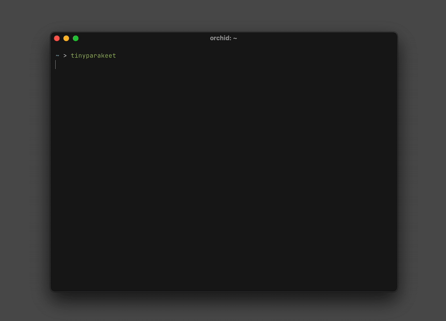

# `tinyparakeet`



Tiny CLI dictation for macOS. Records from the system default mic, streams transcription with NVIDIA Parakeet (CoreML on the Neural Engine via [FluidAudio](https://github.com/FluidInference/FluidAudio)) so text appears as you speak, and copies the final to the clipboard.

Final text is also written to stdout when piped or redirected.

## Build

Requires macOS 14+ and the Swift toolchain (`swift --version`).

```shell
swift build -c release
```

Binary lands at `./.build/release/tinyparakeet`.

## Use

```shell
tinyparakeet                     # record, press Enter, copies to clipboard
tinyparakeet --list-devices
tinyparakeet --device "AirPods"  # case-insensitive substring match
tinyparakeet --no-copy           # skip the clipboard
tinyparakeet > note.txt          # piped/redirected: final text on stdout
```

First run downloads the Parakeet EOU 120M streaming CoreML model (English, 160 ms chunks) from Hugging Face; subsequent runs use the local cache.
